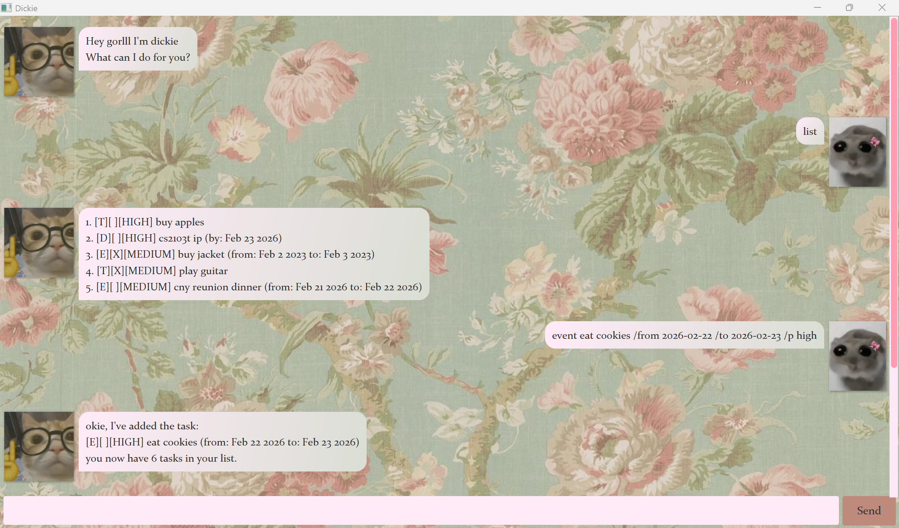

# Dickie User Guide

**Dickie** is your task management chatbot, designed to help you track todos, deadlines, and events quickly and easily.

---

## Quick Start

1. Ensure you have **Java 17 or above** installed on your computer. Mac users: ensure you have the precise JDK version prescribed [here](https://se-education.org/guides/tutorials/javaInstallationMac.html).
2. Download the latest `.jar` file from [here](https://github.com/nrysho/ip/releases).
3. Copy the file to the folder you want to use as Dickie's home folder.
4. Open a command terminal, `cd` into that folder, and run: `java -jar dickie.jar`
5. A GUI similar to the below should appear in a few seconds.
   
6. Type a command in the input box and press **Enter**. Some commands to try:
    - `list` — lists all your tasks.
    - `todo Buy groceries /p low` — adds a to-do.
    - `deadline Submit report /by 2026-03-01 /p high` — adds a deadline.
    - `mark 1` — marks the 1st task as done.
    - `delete 1` — deletes the 1st task.
7. Refer to the Features section below for the full details of each command.

---

## Features

> **Command format notes:**
> - Words in `UPPER_CASE` are values you supply.

---

### Listing all tasks : `list`

Shows all tasks in your list.

```
list
```

---

### Finding tasks : `find`

Searches for tasks whose names contain the given keyword. The search is case-insensitive.

```
find KEYWORD
```

**Example:**
```
find report
```

---

### Adding a to-do : `todo`

Adds a task with no date attached.

```
todo TASK /p PRIORITY
```

**Examples:**
```
todo Buy groceries /p low
todo Submit timesheet /p high
```

---

### Adding a deadline : `deadline`

Adds a task with a due date.

```
deadline TASK /by YYYY-MM-DD /p PRIORITY
```

**Examples:**
```
deadline Submit report /by 2026-03-01 /p low
deadline Pay taxes /by 2026-04-15 /p high
```

---

### Adding an event : `event`

Adds a task with a start and end date.

```
event TASK /from YYYY-MM-DD /to YYYY-MM-DD /p PRIORITY
```

**Examples:**
```
event Team offsite /from 2026-03-10 /to 2026-03-12 /p low
event Conference /from 2026-04-01 /to 2026-04-03 /p medium
```

---

### Marking a task as done : `mark`

Marks the task at the given `INDEX` as completed. The index refers to the number shown in `list`.

```
mark INDEX
```

**Example:**
```
mark 2
```

---

### Unmarking a task : `unmark`

Marks a completed task as not done.

```
unmark INDEX
```

**Example:**
```
unmark 2
```

---

### Deleting a task : `delete`

Permanently removes the task at the given `INDEX`.

```
delete INDEX
```

**Example:**
```
delete 3
```

---

## Saving Your Data

Dickie saves your tasks automatically after every change — no manual saving needed.

---

## Command Summary

| Action         | Format                                                   |
|----------------|----------------------------------------------------------|
| List all tasks | `list`                                                   |
| Find tasks     | `find KEYWORD`                                           |
| Add a to-do    | `todo TASK /p PRIORITY`                                  |
| Add a deadline | `deadline TASK /by YYYY-MM-DD /p PRIORITY`               |
| Add an event   | `event TASK /from YYYY-MM-DD /to YYYY-MM-DD /p PRIORITY` |
| Mark as done   | `mark INDEX`                                             |
| Unmark as done | `unmark INDEX`                                           |
| Delete a task  | `delete INDEX`                                           |